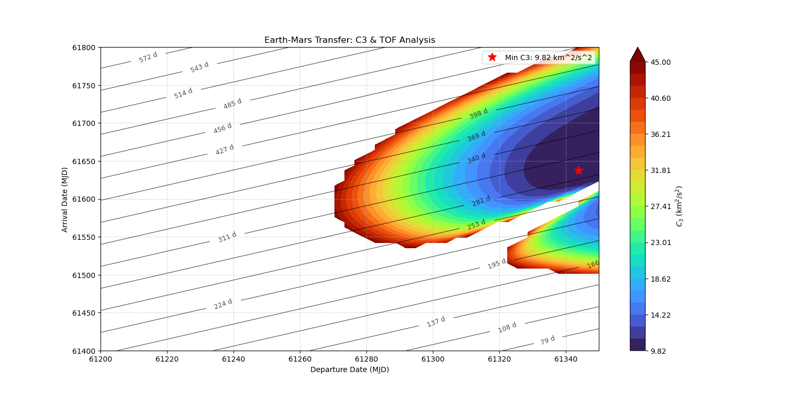
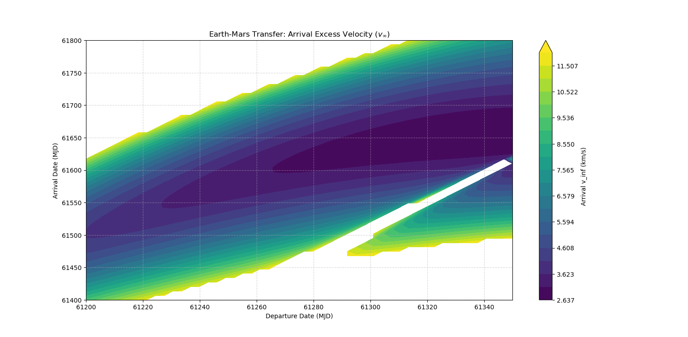
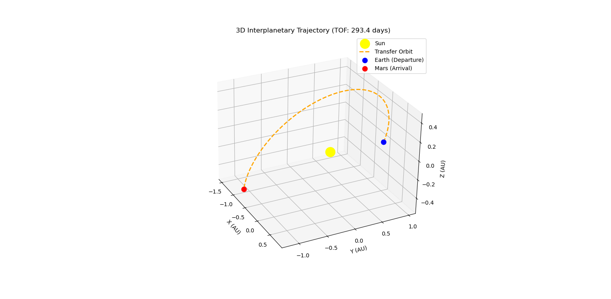

# Interplanetary Transfer Optimization (Earth-Mars)

## Project Overview
This project presents a comprehensive astrodynamic analysis and numerical optimization for an interplanetary transfer mission from Earth to Mars. Using **Python**, **Astropy**, and **Poliastro**, I developed an automated framework to compute launch windows, construct Porkchop plots, solve Lambert's boundary-value problem, and visualize the true 3D heliocentric trajectory.

The project evaluates the energy requirements ($C_3$) and time of flight (TOF) for Earth-to-Mars missions, highlighting the differences between idealized Keplerian models (Hohmann) and realistic non-coplanar, eccentric orbital geometries.

## Mission Scenario & Optimal Parameters
*   **Transfer Type:** Earth-Mars Type I Interplanetary Transfer
*   **Optimal Departure Date:** October 30, 2026 (MJD 61343.9)
*   **Optimal Arrival Date:** August 20, 2027 (MJD 61637.3)
*   **Time of Flight (TOF):** 293.4 days (~9.6 months)
*   **Launch Energy ($C_3$):** $9.82 \text{ km}^2/\text{s}^2$

## Analytical Framework & Methodology
1.  **Ephemeris Generation:** Utilizing high-precision astronomical frameworks to extract true planetary positions and velocities for Earth and Mars across a dense temporal grid.
2.  **Porkchop Plot Grid Search:** Sweeping departure and arrival epochs to compute characteristic energy ($C_3$) and TOF contours, locating the absolute minimum energy window.
3.  **Lambert Problem Solver:** Solving boundary-value problems using universal variables to determine transfer heliocentric velocity vectors.
4.  **3D Propagation:** Propagating the optimized keplerian orbit to visualize spatial alignment.

---

## Technical Analysis & Results

### 1. Porkchop Plot ($C_3$ Contour Analysis)

This contour plot maps the characteristic energy ($C_3$) and Time of Flight across the 2026–2027 synodic window.
*   **Global Minimum:** The absolute minimum $C_3$ of **$9.82 \text{ km}^2/\text{s}^2$** is pinpointed by the optimization algorithm, identifying the most propulsively efficient launch window.
*   **Contours:** Multi-level contour lines allow mission designers to trade off launch energy against flight duration.

### 2. Arrival Excess Velocity ($v_\infty$)

This visualization maps the hyperbolic excess velocity vector upon arrival at Mars.
*   **Deep-Space Insertion Planning:** Quantifies the magnitude of $v_\infty$ required for Mars orbit insertion (MOI) or atmospheric entry braking, validating the aerocapture or propulsive delta-v budget requirements.

### 3. 3D Interplanetary Trajectory

The geometric representation of the optimized heliocentric transfer orbit in 3D space.
*   **Orbital Realism:** Unlike simplified coplanar models, this trajectory factors in Mars' orbital eccentricity ($e \approx 0.093$) and inclination ($1.85^\circ$), displaying the exact spatial intersection with planetary positions at arrival.

---

## Scientific Validation & Benchmarking

To verify the physical consistency of the results, the optimized model was benchmarked against classical textbook theory (Howard D. Curtis) and a real historical mission:

| Mission Parameter | Your Model (Optimized) | Ideal Hohmann (Curtis) | NASA Mars 2020 (Perseverance) |
| :--- | :--- | :--- | :--- |
| **Launch Energy ($C_3$)** | **$9.82 \text{ km}^2/\text{s}^2$** | $8.68 \text{ km}^2/\text{s}^2$ | $14.49 \text{ km}^2/\text{s}^2$ |
| **Time of Flight (TOF)** | **$293.4 \text{ days}$** | $258.9 \text{ days}$ | $203.0 \text{ days}$ |

*   **Hohmann Comparison:** The analytical Hohmann transfer assumes coplanar, circular orbits ($r_1 = 1.0\text{ AU}$, $r_2 = 1.524\text{ AU}$), yielding a lower theoretical energy ($8.68\text{ km}^2/\text{s}^2$) and shorter TOF ($258.9$ days). The slight increase in the optimized model's $C_3$ and TOF perfectly reflects the real-world eccentricity and out-of-plane geometry of Mars.
*   **Mars 2020 Benchmark:** NASA's Mars 2020 mission utilized a faster, aggressive, high-energy trajectory ($203$ days, $C_3 \approx 14.49\text{ km}^2/\text{s}^2$) to accommodate a heavy payload and strict operational deadlines, confirming that our low-energy trajectory represents an efficient baseline.

---

## Technical Skills Demonstrated
*   **Orbital Mechanics:** Proficiency in Keplerian elements, Lambert's problem formulation, state vector conversions, and heliocentric orbit propagation.
*   **Numerical Optimization:** Grid-search optimization techniques to isolate global minima in complex cost functions ($C_3$ landscapes).
*   **Python Scientific Stack:** Advanced data handling, matrix operations (NumPy), ephemeris calculations (Astropy, Poliastro), and high-resolution aerospace data visualization (Matplotlib).

## Project Structure
```text
├── src/   # Python source code for Porkchop generation and Lambert solving
├── results/   # Generated PNG visualizations (Porkchop, Arrival Velocity, 3D Trajectory)
└── README.md
```

## Author
**Giuliano Pennacchio**  
*Aerospace Engineer (MSc) | Specialization in GNC & Flight Dynamics*

## Contact
[](mailto:giuliano.pennacchio12@gmail.com) 
[](https://www.linkedin.com/in/giuliano-pennacchio-5385572b7/)
[](https://github.com/GiulianoPennacchioJ)

---
*Developed as part of my Flight Dynamics & Astrodynamics Portfolio.*